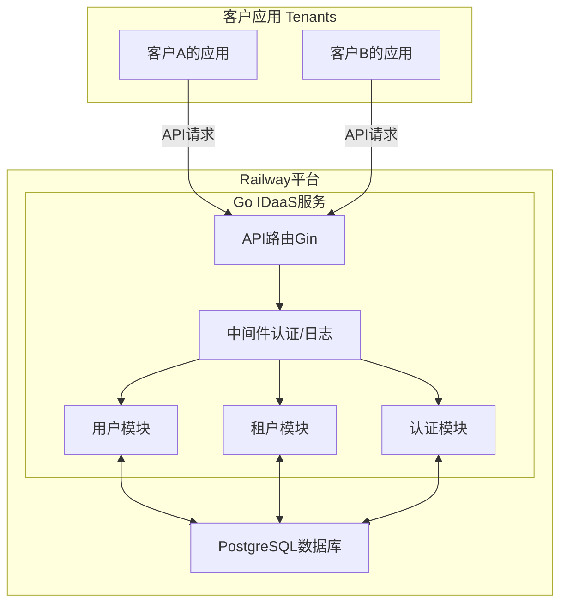

### **基于Go和Railway的IDaaS平台技术方案**

#### **1. 愿景与目标**

本方案旨在设计并实现一个安全、高性能、可扩展的“身份认证即服务”（IDaaS）平台。该平台将作为一项独立的SaaS服务，通过API向客户（其他开发者或应用）提供全面的用户认证和管理功能。

我们将采用 **Go语言** 以确保服务的极致性能和并发处理能力，并选择 **Railway** 作为部署平台，以利用其极致简化的部署流程和“按需使用、自动扩展”的现代化云原生特性。

#### **2. 技术架构**

我们将采用**模块化的单体应用（Modular Monolith）**架构。这种架构在项目初期兼具微服务的代码清晰度和单体应用的部署简单性，非常适合在Railway上进行快速迭代和部署。

##### **2.1 架构图**



- **Go IDaaS 服务**: 这是一个单一的、可独立部署的Go应用程序。它内部逻辑清晰地划分为不同的模块（用户、租户、认证），但作为一个整体进行部署和扩展。
    
- **PostgreSQL 数据库**: 由Railway平台管理的数据库服务。我们的Go应用通过Railway自动注入的`DATABASE_URL`环境变量与其连接。
    
- **客户应用**: 调用我们IDaaS平台API的第三方应用。
    

#### **3. 技术栈选型**

|类别|技术选型|优势|
|---|---|---|
|**语言**|**Go (Golang)**|极致的性能与并发能力，编译为静态二进制文件，部署简单，非常适合构建基础设施服务。|
|**Web框架**|**Gin**|一个高性能、API简洁的Go Web框架，拥有出色的路由和中间件支持。|
|**数据库**|**PostgreSQL**|功能强大，支持事务和行级安全，是构建多租户应用的理想选择。|
|**ORM/数据库驱动**|**sqlc / pgx**|sqlc 可以从原生SQL文件生成完全类型安全的Go代码，完美结合了SQL的灵活性和Go的类型安全；pgx 作为底层驱动，性能卓越。|
|**密码哈希**|**`golang.org/x/crypto/bcrypt`**|Go官方提供的加密库，安全可靠，是密码存储的标准实践。|
|**身份令牌**|**JWT (JSON Web Tokens)**|使用 `golang-jwt/jwt` 库来生成和验证无状态的身份令牌。|
|**部署平台**|**Railway**|“零配置”部署体验，按量计费，自动扩展，与GitHub工作流完美集成。|

#### 4. 代码目录架构

此目录结构遵循了Go社区推崇的**[标准项目布局](https://github.com/golang-standards/project-layout "null")**，并结合了我们选择的**模块化单体应用**架构。这种设计确保了清晰的关注点分离：`internal/api`层只负责HTTP请求的接收与响应；`internal/user`或`internal/tenant`等业务模块负责核心业务逻辑处理；而`internal/store`层则专职于数据持久化，各层职责单一，互不侵犯。更重要的是，它提供了卓越的架构可扩展性。当未来业务增长，需要对某个特定功能（如认证）进行独立扩容时，可以将对应的模块（`/internal/auth`）直接剥离，封装成一个独立的微服务，而无需对整个系统进行大规模重构。

```
/idaas-service
├── cmd/
│   └── server/
│       └── main.go              # 应用主入口：初始化配置、数据库、路由并启动服务
│
├── internal/                    # Go语言工具链强制规定，项目外的代码无法导入internal目录下的任何包。这一特性天然地为我们的核心业务逻辑提供了强大的封装性，防止了内部实现细节的意外泄露，是实现清晰架构边界的关键。
│   ├── api/                     # API层：HTTP路由和处理器 (Handlers)
│   │   ├── handlers/            # 按业务领域划分的请求处理器
│   │   │   ├── auth_handler.go
│   │   │   ├── tenant_handler.go
│   │   │   └── user_handler.go
│   │   ├── middleware/          # Gin中间件：如API密钥认证、JWT验证、日志记录
│   │   │   └── auth.go
│   │   └── router.go            # Gin路由的集中定义
│   │
│   ├── auth/                    # 认证模块：核心认证逻辑
│   │   ├── password.go          # 密码哈希与验证 (bcrypt)
│   │   └── token.go             # JWT令牌的生成与解析
│   │
│   ├── config/                  # 配置管理
│   │   └── config.go            # 从环境变量加载和解析应用配置
│   │
│   ├── store/                   # 数据存储层 (核心)
│   │   ├── database/            # 数据库连接与sqlc生成的代码
│   │   │   ├── db.go            # 数据库连接池(pgx)初始化
│   │   │   ├── models.go        # (sqlc生成) 数据库模型
│   │   │   └── querier.go       # (sqlc生成) 查询接口
│   │   └── queries/             # 原生SQL查询文件 (供sqlc使用)
│   │       ├── tenant.sql
│   │       └── user.sql
│   │
│   ├── tenant/                  # 租户模块：租户相关的业务逻辑
│   │   └── service.go
│   │
│   └── user/                    # 用户模块：用户相关的业务逻辑
│       └── service.go
│
├── migrations/                  # 数据库迁移文件
│   ├── 0001_initial_schema.up.sql
│   └── 0001_initial_schema.down.sql
│
├── Dockerfile                   # 用于Railway部署的容器化配置
├── go.mod                       # Go模块依赖文件
├── go.sum                       # Go模块校验和
├── sqlc.yaml                    # sqlc代码生成工具的配置文件
└── .cursor-rules                # (核心) 为Cursor AI助手定义的项目规则
```


#### **5. 数据库设计 (PostgreSQL多租户模型)**

数据隔离是SaaS平台的基石。我们将在所有核心表中引入 `tenant_id` 字段来实现严格的多租户数据隔离。

```
-- 表: tenants
-- 描述: 存储我们的客户（租户）信息。
CREATE TABLE IF NOT EXISTS tenants (
    id VARCHAR(255) PRIMARY KEY, -- 租户ID, 例如 tnt_...
    name VARCHAR(255) NOT NULL, -- 客户的应用名称
    api_secret_key_hash VARCHAR(255) UNIQUE NOT NULL, -- 用于服务器间调用的密钥的哈希值
    api_public_key VARCHAR(255) UNIQUE NOT NULL, -- 用于客户端调用的可公开密钥
    created_at TIMESTAMPTZ DEFAULT CURRENT_TIMESTAMP NOT NULL
);

-- 表: users
-- 描述: 存储所有租户的用户。
CREATE TABLE IF NOT EXISTS users (
    id VARCHAR(255) PRIMARY KEY, -- 全局唯一的用户ID, 例如 usr_...
    tenant_id VARCHAR(255) NOT NULL REFERENCES tenants(id) ON DELETE CASCADE, -- 外键，关联到租户表。
    email VARCHAR(255) NOT NULL,
    hashed_password VARCHAR(255), -- 存储哈希后的密码
    profile JSONB, -- 存储用户自定义的元数据
    created_at TIMESTAMPTZ DEFAULT CURRENT_TIMESTAMP NOT NULL,
    -- 确保在同一个租户内，邮箱是唯一的
    UNIQUE(tenant_id, email)
);

```

#### **6. API 设计与安全机制**

- **API密钥认证**: 客户的后端服务在调用我们的管理API时，必须在`Authorization`请求头中提供其`Secret Key`。我们的API中间件会验证此密钥以识别租户。
    
- **JWT用户会话**: 最终用户登录成功后，我们的认证服务会签发一个JWT。此JWT的载荷（Payload）中必须包含`userId`和`tenant_id`，以确保用户的所有后续操作都严格限制在其所属的租户范围内。
    
- **核心API端点**: **API版本控制**: 所有API端点都将采用URL路径版本控制（例如 `/v1/...`）。这种策略清晰直观，允许我们在未来推出`v2`版本时，平滑地迁移客户，而不会影响现有集成。
    
    - `POST /v1/tenants`: 创建一个新租户（客户应用）。
        
    - `POST /v1/auth/register`: 为当前租户注册一个新用户。
        
    - `POST /v1/auth/login`: 用户登录并获取JWT。
        
    - `GET /v1/users/me`: （需JWT认证）获取当前用户的个人资料。
        
    - `GET /v1/users/{userId}`: （需API密钥认证）租户管理员获取其下某个用户的资料。
        

#### 7. 在Railway上的部署流程

##### **步骤一：项目准备与Dockerfile**

在您的Go项目根目录下，创建一个 `Dockerfile`。Railway会优先使用它来构建您的应用。

```
# --- 构建阶段 ---
FROM golang:1.22-alpine AS builder
WORKDIR /app
COPY go.mod go.sum ./
RUN go mod download
COPY . .
RUN CGO_ENABLED=0 GOOS=linux go build -o /main .

# --- 运行阶段 ---
FROM alpine:latest
WORKDIR /root/
COPY --from=builder /main .
# 复制可能需要的根证书
COPY --from=builder /etc/ssl/certs/ca-certificates.crt /etc/ssl/certs/
EXPOSE 8080
HEALTHCHECK --interval=30s --timeout=3s CMD curl -f http://localhost:8080/health || exit 1
CMD ["./main"]

```

##### **步骤二：连接GitHub并部署**

1. 将您的Go项目代码推送到一个GitHub仓库。
    
2. 在Railway仪表板上，点击“New Project”并选择“Deploy from GitHub repo”。
    
3. 选择您的项目仓库。Railway将自动检测到`Dockerfile`并开始构建和部署。
    

##### **步骤三：添加数据库和配置环境变量**

1. 在项目的“画布”界面，点击“New” -> “Database” -> “PostgreSQL”。
    
2. Railway会自动创建一个PostgreSQL服务，并将其连接字符串作为`DATABASE_URL`环境变量注入到您的Go服务中。
    
3. 点击您的Go服务，进入“Variables”选项卡，添加其他所需的环境变量，例如：
    
    - `JWT_SECRET`: 用于签名JWT的密钥。
        
    - `PORT`: Railway会自动设置，您的Go应用需要监听此端口。
        

##### **步骤四：暴露服务与自定义域名**

1. **数据库迁移**: 在Railway上，可以在部署命令中加入数据库迁移脚本。首先，使用一个迁移工具（如 `golang-migrate` 或 `sql-migrate`）来管理SQL迁移文件。然后，在Railway服务的部署设置中，修改部署命令为 `migrate-tool-up && ./main`。这可以确保每次部署新代码时，数据库结构总是先被更新到最新版本，然后再启动应用服务，从而保证数据结构和代码逻辑的一致性。
    
2. 部署成功后，点击您的Go服务，进入“Settings”选项卡。
    
3. Railway会自动为您生成一个可公开访问的域名（如 `idaas-prod.up.railway.app`）。
    
4. 您可以在此页面添加您自己的自定义域名。
    

通过以上步骤，您的Go语言IDaaS平台就已经成功部署在Railway上，并准备好为全球客户提供服务。这个架构既保证了Go语言带来的高性能和高可靠性，又享受了Railway平台带来的极致部署便利性和弹性伸缩能力。